In this document, you will learn how to deploy E2 simulator on lab K8s cluster with your own change.

## Prepare in Gitlab

Create a branch for yourself by clicking on `plus` button as following:

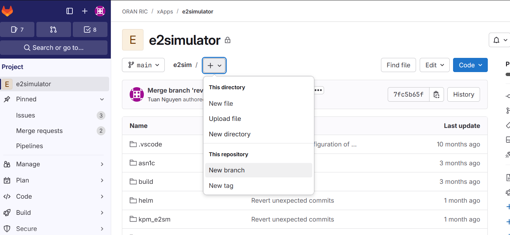

Name your branch according to the format `oran-student-???`, make sure `???` is the same as your username to access devvm as well as your namespace created in Kubernetese. For example, my K8s namespace is `tuan`, and my username to devvm is also `tuan`, then my branch name is `oran-student-tuan`.

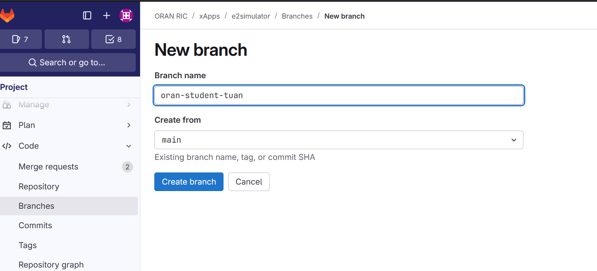

Now at the left sidebar, go to `Build` -> `Pipelines` and click on `New pipeline`.

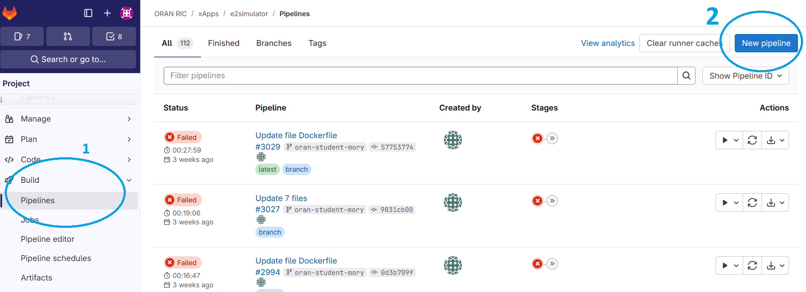

Select your own branch and run `New pipeline`.

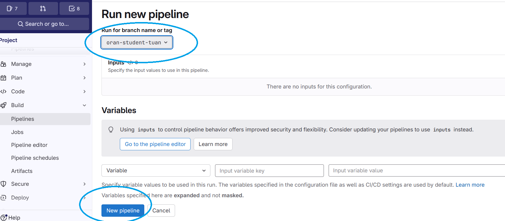

After that, you should see this screen. When a job is running, you can click on it to see the detail.

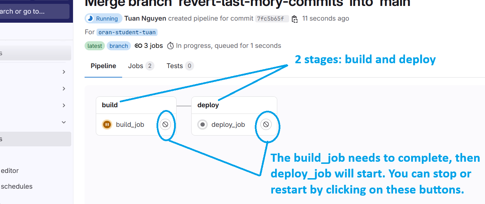

The detail of a job is like this:

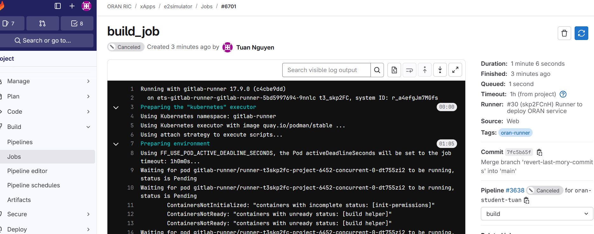

You need to wait until the job is done. If a job is succesful, you will see its message at the end of the terminal area, for example:

- A succesful build job

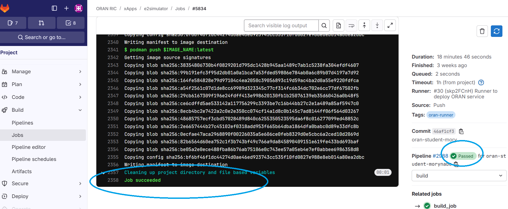

- A succesful deploy job

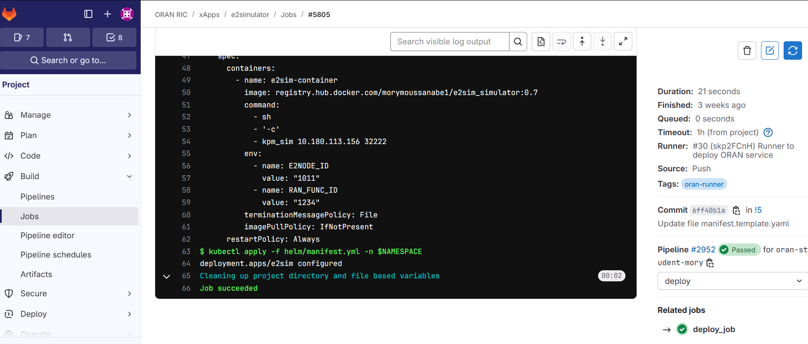

## Verify in lab Kubernetese

Once the deploy job succeeds in Gitlab, you open Lens and you should see the following:

- `Workloads` -> `Deployments`

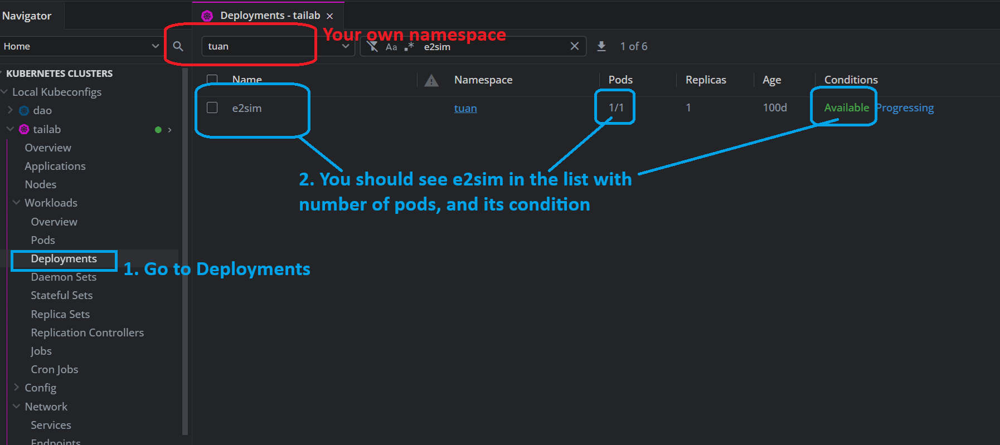

- `Workloads` -> `Pods`

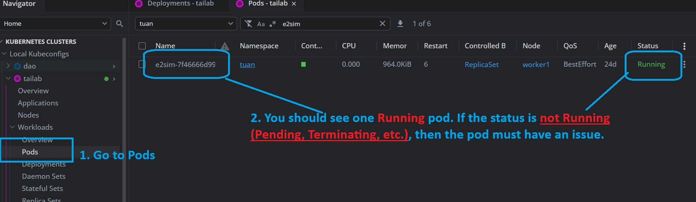

- Pod details

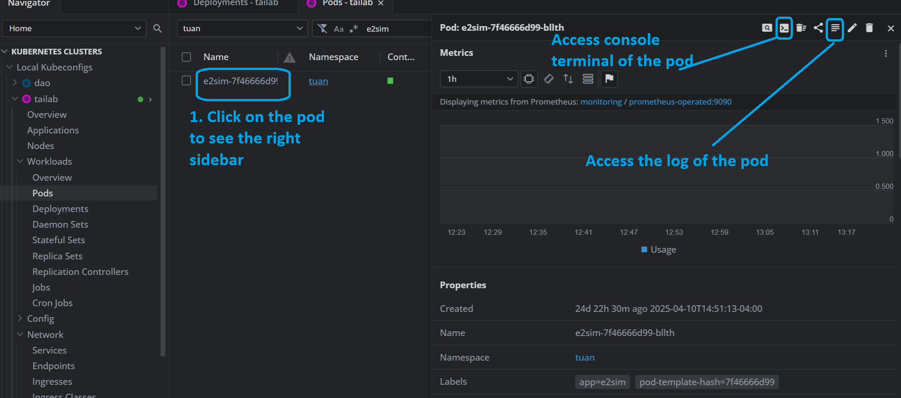