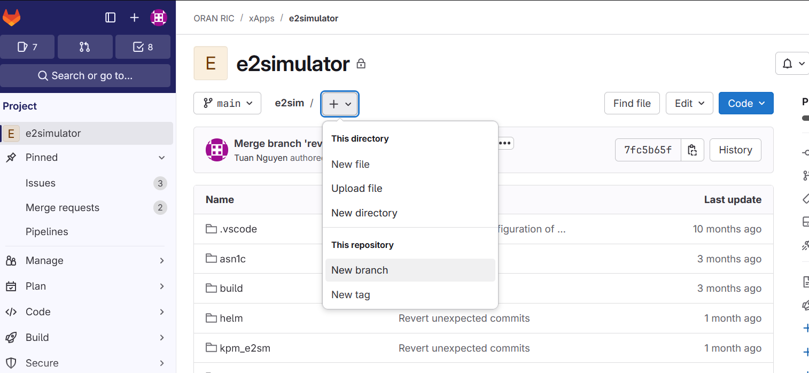
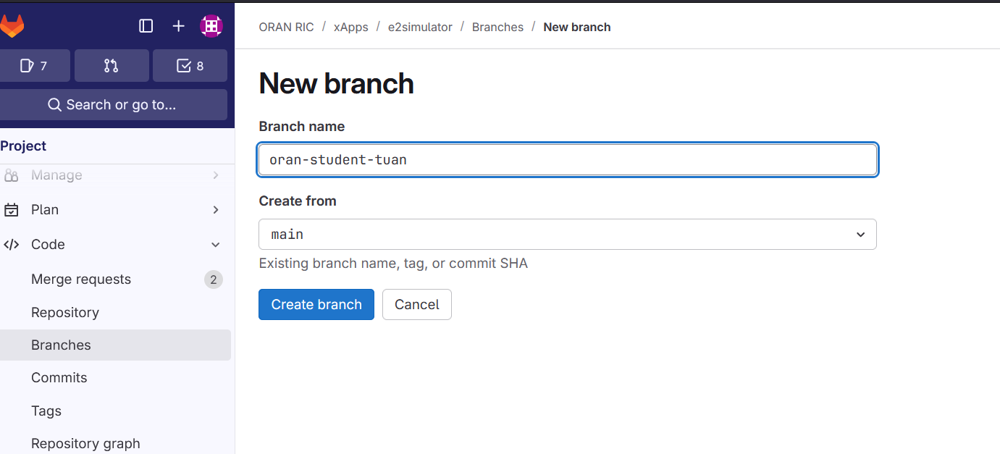
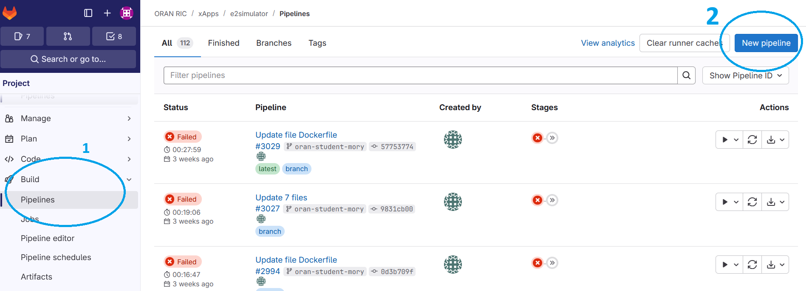
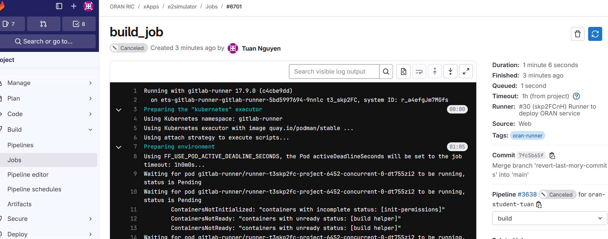
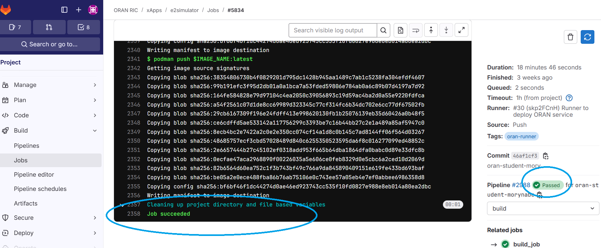
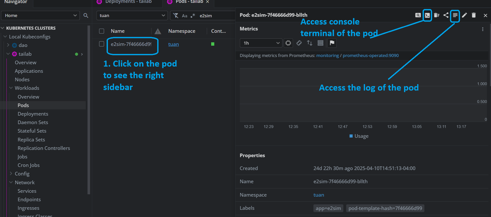
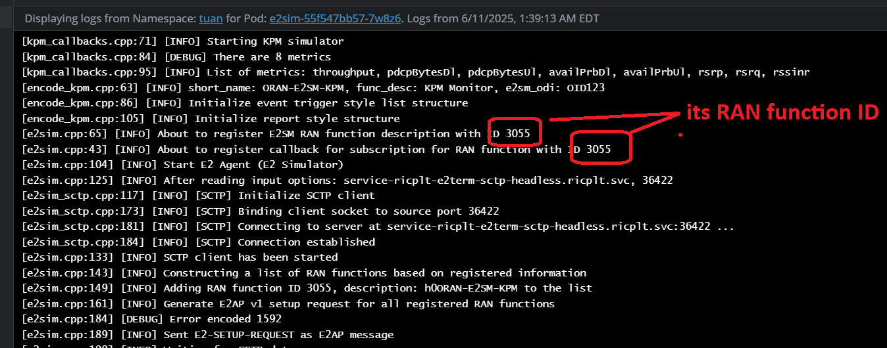

In this document, you will learn how to deploy E2 simulator on lab K8s cluster with your own change.

## Prepare in Gitlab

Create a branch for yourself by clicking on `plus` button as following:

Name your branch according to the format `oran-student-???`, make sure `???` is the same as your username to access devvm as well as your namespace created in Kubernetese. For example, my K8s namespace is `tuan`, and my username to devvm is also `tuan`, then my branch name is `oran-student-tuan`.

Now at the left sidebar, go to `Build` -> `Pipelines` and click on `New pipeline`.

Select your own branch and run `New pipeline`.

After that, you should see this screen. When a job is running, you can click on it to see the detail.

The detail of a job is like this:

You need to wait until the job is done. If a job is succesful, you will see its message at the end of the terminal area, for example:

- A succesful build job

- A succesful deploy job

## Verify in lab Kubernetese

Once the deploy job succeeds in Gitlab, you open Lens and you should see the following:

- `Workloads` -> `Deployments`

- `Workloads` -> `Pods`

- Pod details

## E2 node ID

In this section, you will figure out the ID registered by E2sim with near-RT RIC platform. First, click on the pod e2sim, and select to view its log.

You will see the RAN function ID registered by the E2sim, in this example, 3055.

Run the command `curl --location 'http://10.180.113.156:32137/v1/e2t/list'` in devvm terminal, you will get the list of connected E2 nodes.

Then use the command `curl --location 'http://10.180.113.156:32137/v1/nodeb/<pass-e2-node-id-here>'` to verify if its RAN function ID is the one registered by your E2 node. 

In the above screenshot, it is 2531, so you need to check other E2 node ids until you get 3055.